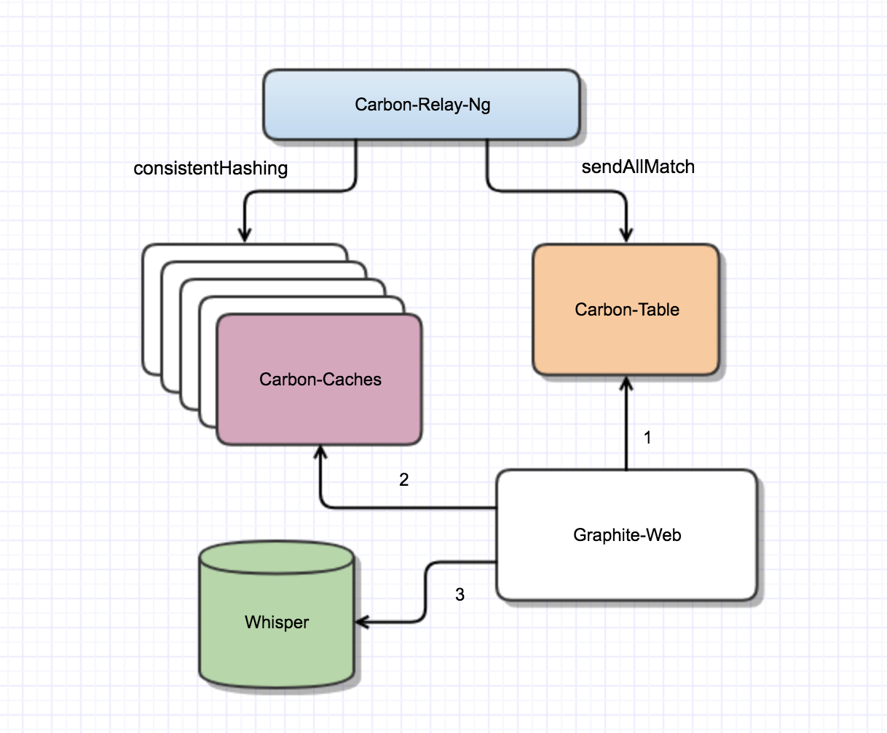

carbon-table
============

.. image:: https://travis-ci.org/yunstanford/carbon-table.svg?branch=master
    :alt: build status
    :target: https://travis-ci.org/yunstanford/carbon-table

.. image:: https://codecov.io/gh/yunstanford/carbon-table/branch/master/graph/badge.svg
    :target: https://codecov.io/gh/yunstanford/carbon-table

Carbon-Table backends with Gin and Trie Tree that supports fast resolving Graphite-Like wildcards query.
This is designed to put behind ``carbon-relay-ng`` and regsiter ``sendAllMatch`` route. That way, Graphite-Web
doesn't need to send requests to all Carbon-Cache Instances for wildcard queries.

